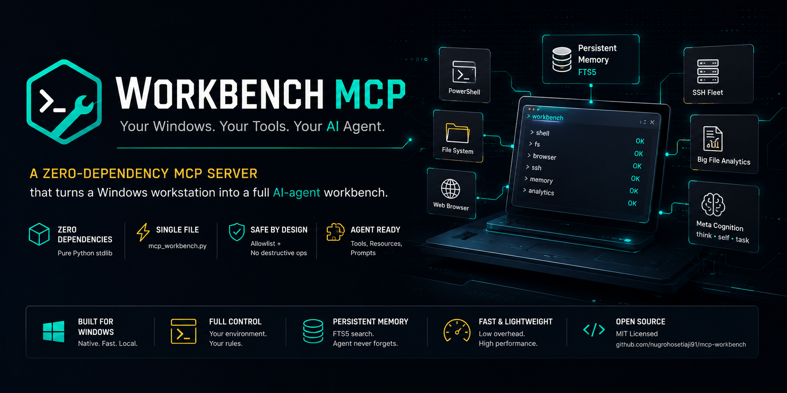
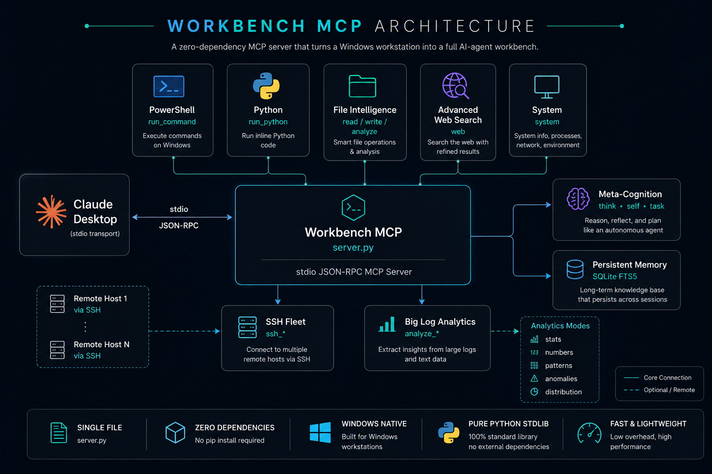

<p align="center">
  
</p>

# workbench-mcp

A zero-dependency **MCP (Model Context Protocol) server** that turns a Windows workstation into a full AI-agent workbench. Built for Claude Desktop (stdio transport), pure Python standard library - no `pip install` required.

## Architecture

<p align="center">
  
</p>

Single file, single process: Claude Desktop spawns `server.py` over stdio, every tool call is a JSON-RPC request, and all state (memory DB, experience log) lives next to the script.

## Features

**System control**
- `run_command` - PowerShell execution with timeout control
- `run_python` - inline Python execution for data processing and validation
- `system` - process listing, kill, system info, screenshots

**Persistent memory**
- SQLite **FTS5 full-text search** knowledge base with automatic index triggers
- Key-prefix organization mapped to a 5-stage learning progression (`failure:` -> `verified:` -> `rule:`, plus `skill:`/`insight:`/`pattern:`) so an agent can accumulate and retrieve knowledge across sessions instead of restarting from zero every time

**File intelligence**
- Read / write / list / regex search across the filesystem
- Built-in big-data analysis modes: `stats`, `numbers`, `patterns`, `anomalies`, `distribution` - summarize multi-MB log files without flooding the model context

**Remote fleet (SSH)**
- Run commands on remote Linux servers via configurable host aliases
- Includes an env-normalization layer that fixes Windows OpenSSH failures under Claude Desktop's stripped process environment (missing `PROGRAMDATA` / `PATHEXT` / `COMSPEC`)

**Browser control (CDP)**
- `browser` - drives Chrome/Edge/Brave directly over the DevTools Protocol (launch, navigate, click, scroll, type, snapshot, screenshot, execute JS, tabs) - no Selenium/Playwright dependency, raw stdlib websocket implementation
- `stealth_browser` - fallback variant with rotating user-agent and fingerprint masking, for when a site's bot defenses flag the plain browser tool. Meant for personal-scale research/automation on your own sessions - respect target sites' terms of service

**Domain example: trading-bot log analytics**
- Deterministic parser for structured bot logs: win/loss stats, profit factor, PnL per exit-reason and per hour, hold-duration analysis - demonstrates how to give an agent *reliable* analytics instead of letting it guess from raw text

**Meta-cognition**
- `think` - forces first-principles reasoning before actions
- `self` - experience logging, review, and self-improvement loop
- `task` - Dynamic-Workflow-style executor: `run` (sequential), `parallel` (real concurrency via a thread pool - fan out N tool calls, synthesize the results yourself), `pipeline` (sequential with `{prev}` result substitution between stages), `loop_until` (repeat a step until a condition on its result is met)
- Built-in **verifier discipline**: the system prompt this server injects explicitly warns against trusting self-critique (a model grading its own output is measurably weaker than independent verification) and pushes toward observing actual results - running the code, reading the file back, looking at the screenshot - before logging success
- **Vision self-check**: for anything visual, the workflow is take screenshot -> actually look at it -> compare against the goal -> only then declare done, not "this should render correctly"

## Real-world usage

This is not a demo project. This server is my daily driver: it powers an AI assistant that manages my Windows workstation - auditing and patching trading-bot code, running log analytics on multi-MB files, executing remote commands on production VPS hosts over SSH, driving a browser for research tasks, and accumulating knowledge in the FTS5 memory across sessions. This repository itself was sanitized, validated, and published to GitHub through this exact server - the whole pipeline, from secret-stripping to the git push, ran on its own tools.

Because it's a standard MCP server, it isn't locked to one client - the same `server.py` process/memory DB is registered with Claude Desktop, Google's Gemini CLI / Antigravity (`gemini mcp add`), and OpenAI Codex CLI on my machine at once. All three read the same FTS5 knowledge base and experience log, so a lesson one of them writes is available to the others on their very next session.

## Why zero dependencies?

Claude Desktop launches stdio MCP servers with a stripped environment where virtualenvs and PATH-dependent tooling often break. A single stdlib-only file is the most robust deployment unit: copy, point your config at it, done.

## Setup

1. Requires Python 3.11+ on Windows.
2. Add to your Claude Desktop config (`%APPDATA%\Claude\claude_desktop_config.json`):

```json
{
  "mcpServers": {
    "workbench": {
      "command": "python",
      "args": ["C:\\path\\to\\server.py"],
      "env": {
        "WORKBENCH_SSH_HOSTS": "{\"prod\": \"user@10.0.0.1\"}"
      }
    }
  }
}
```

3. Restart Claude Desktop. Memory DB (`workbench_memory.db`) is created next to `server.py` automatically.

Any other MCP-compatible client works the same way, pointed at the same `server.py`:
- **Gemini CLI / Antigravity**: `gemini mcp add workbench python "C:\path\to\server.py" -s user`
- **Codex CLI**: add a `[mcp_servers.workbench]` block with `command = "python"`, `args = ["C:/path/to/server.py"]` to `config.toml`

Point every client at the *same* file path and they share one memory DB and experience log.

## Configuration

| Env var | Purpose | Default |
|---|---|---|
| `WORKBENCH_DIR` | Working directory for shell commands | directory of `server.py` |
| `WORKBENCH_SSH_HOSTS` | JSON map of SSH aliases | `{}` |

## Architecture notes

- **stdio JSON-RPC** loop, no framework - the full MCP handshake (`initialize`, `tools/list`, `tools/call`) implemented directly for transparency
- FTS5 external-content table with `INSERT`/`UPDATE`/`DELETE` triggers keeping the index in sync
- All subprocess calls carry explicit timeouts; SSH uses `BatchMode=yes` so a hung auth prompt can never freeze the agent
- CDP browser control is a raw stdlib websocket client (no `websockets`/`playwright` dependency) - `_cdp_ws_send` implements just enough of RFC 6455 framing to talk to Chrome's DevTools Protocol
- The `stealth_browser` fingerprint script is registered via `Page.addScriptToEvaluateOnNewDocument` (persists across navigations, fires once per document) rather than `Runtime.evaluate`'d twice on the same page - the latter throws `Cannot redefine property: webdriver` on the second call, since `Object.defineProperty` without `configurable:true` only succeeds once per document

## Acknowledgments

- The `stealth_browser` fingerprint-spoofing technique (webdriver/plugins/languages overrides, `cdc_*` variable removal) is the same community-standard pattern popularized by [puppeteer-extra-plugin-stealth](https://github.com/berstend/puppeteer-extra) and `undetected-chromedriver` - adapted here against raw CDP to keep the zero-dependency constraint. Credit to that open-source lineage for the technique.
- Built with [Claude](https://claude.ai) (Anthropic) as a development partner - architecture review, the CDP browser tools, the meta-cognition framework (verifier discipline, vision self-check, 5-stage memory), and the `task` Dynamic-Workflow primitives were all built and debugged in collaboration with Claude.

## License

MIT
