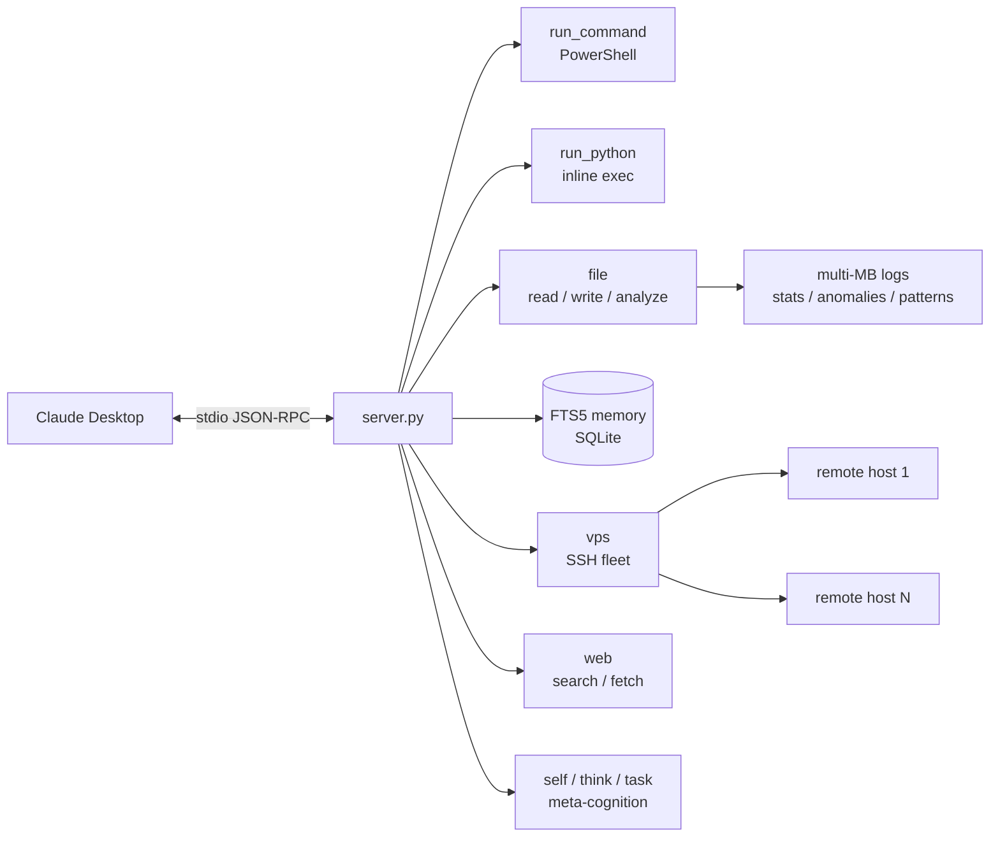

# workbench-mcp

A zero-dependency **MCP (Model Context Protocol) server** that turns a Windows workstation into a full AI-agent workbench. Built for Claude Desktop (stdio transport), pure Python standard library - no `pip install` required.

## Architecture



Single file, single process: Claude Desktop spawns `server.py` over stdio, every tool call is a JSON-RPC request, and all state (memory DB, experience log) lives next to the script.

## Features

**System control**
- `run_command` - PowerShell execution with timeout control
- `run_python` - inline Python execution for data processing and validation
- `system` - process listing, kill, system info, screenshots

**Persistent memory**
- SQLite **FTS5 full-text search** knowledge base with automatic index triggers
- Key-prefix organization (`insight:`, `skill:`, `pattern:`, `fact:`) so an agent can accumulate and retrieve knowledge across sessions

**File intelligence**
- Read / write / list / regex search across the filesystem
- Built-in big-data analysis modes: `stats`, `numbers`, `patterns`, `anomalies`, `distribution` - summarize multi-MB log files without flooding the model context

**Remote fleet (SSH)**
- Run commands on remote Linux servers via configurable host aliases
- Includes an env-normalization layer that fixes Windows OpenSSH failures under Claude Desktop's stripped process environment (missing `PROGRAMDATA` / `PATHEXT` / `COMSPEC`)

**Domain example: trading-bot log analytics**
- Deterministic parser for structured bot logs: win/loss stats, profit factor, PnL per exit-reason and per hour, hold-duration analysis - demonstrates how to give an agent *reliable* analytics instead of letting it guess from raw text

**Meta-cognition**
- `think` - forces first-principles reasoning before actions
- `self` - experience logging, review, and self-improvement loop
- `task` - multi-step executor with progress notes

## Real-world usage

This is not a demo project. This server is my daily driver: it powers an AI assistant that manages my Windows workstation - auditing and patching trading-bot code, running log analytics on multi-MB files, executing remote commands on production VPS hosts over SSH, and accumulating knowledge in the FTS5 memory across sessions. This repository itself was sanitized, validated, and published to GitHub by an AI agent running through this exact server.

## Why zero dependencies?

Claude Desktop launches stdio MCP servers with a stripped environment where virtualenvs and PATH-dependent tooling often break. A single stdlib-only file is the most robust deployment unit: copy, point your config at it, done.

## Setup

1. Requires Python 3.11+ on Windows.
2. Add to your Claude Desktop config (`%APPDATA%\Claude\claude_desktop_config.json`):

```json
{
  "mcpServers": {
    "workbench": {
      "command": "python",
      "args": ["C:\\path\\to\\server.py"],
      "env": {
        "WORKBENCH_SSH_HOSTS": "{\"prod\": \"user@10.0.0.1\"}"
      }
    }
  }
}
```

3. Restart Claude Desktop. Memory DB (`workbench_memory.db`) is created next to `server.py` automatically.

## Configuration

| Env var | Purpose | Default |
|---|---|---|
| `WORKBENCH_DIR` | Working directory for shell commands | directory of `server.py` |
| `WORKBENCH_SSH_HOSTS` | JSON map of SSH aliases | `{}` |

## Architecture notes

- **stdio JSON-RPC** loop, no framework - the full MCP handshake (`initialize`, `tools/list`, `tools/call`) implemented directly for transparency
- FTS5 external-content table with `INSERT`/`UPDATE`/`DELETE` triggers keeping the index in sync
- All subprocess calls carry explicit timeouts; SSH uses `BatchMode=yes` so a hung auth prompt can never freeze the agent

## License

MIT
